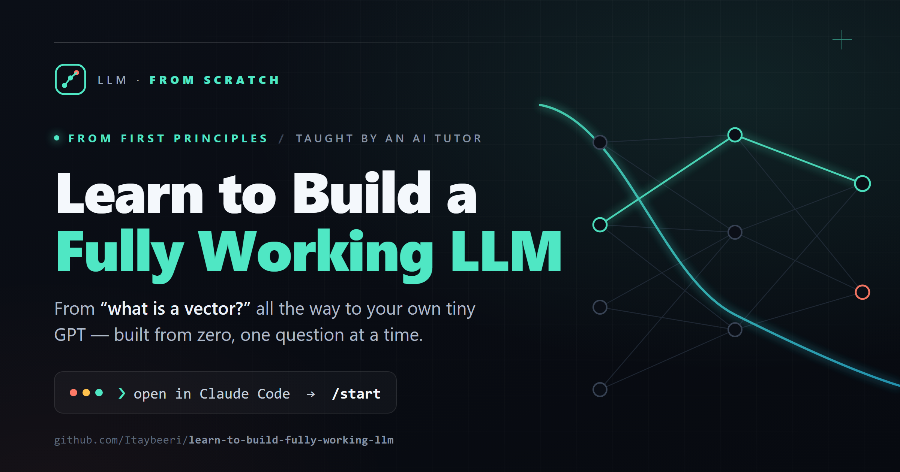
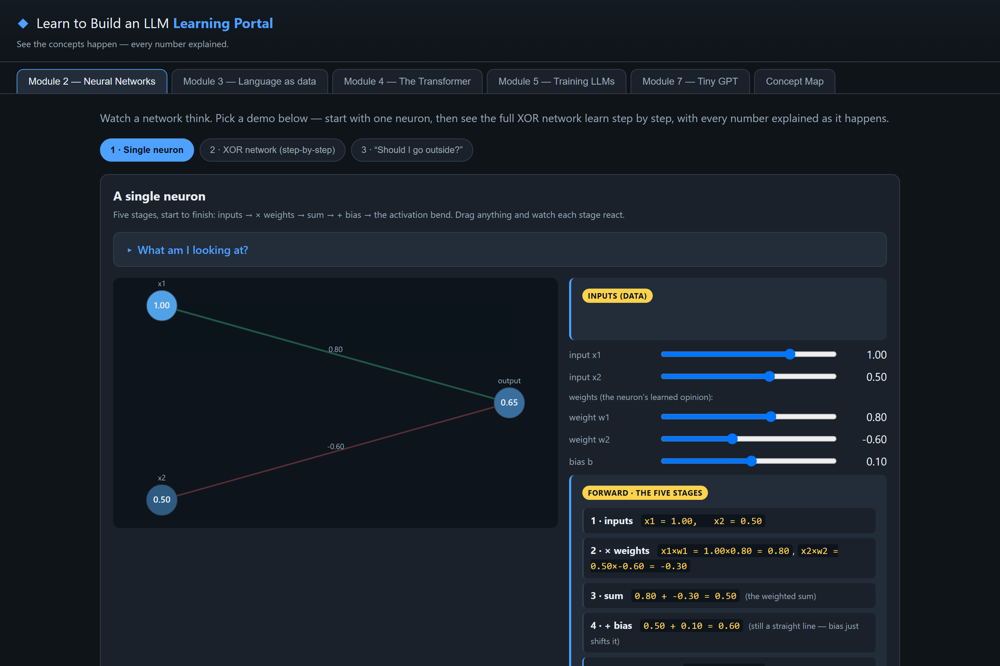
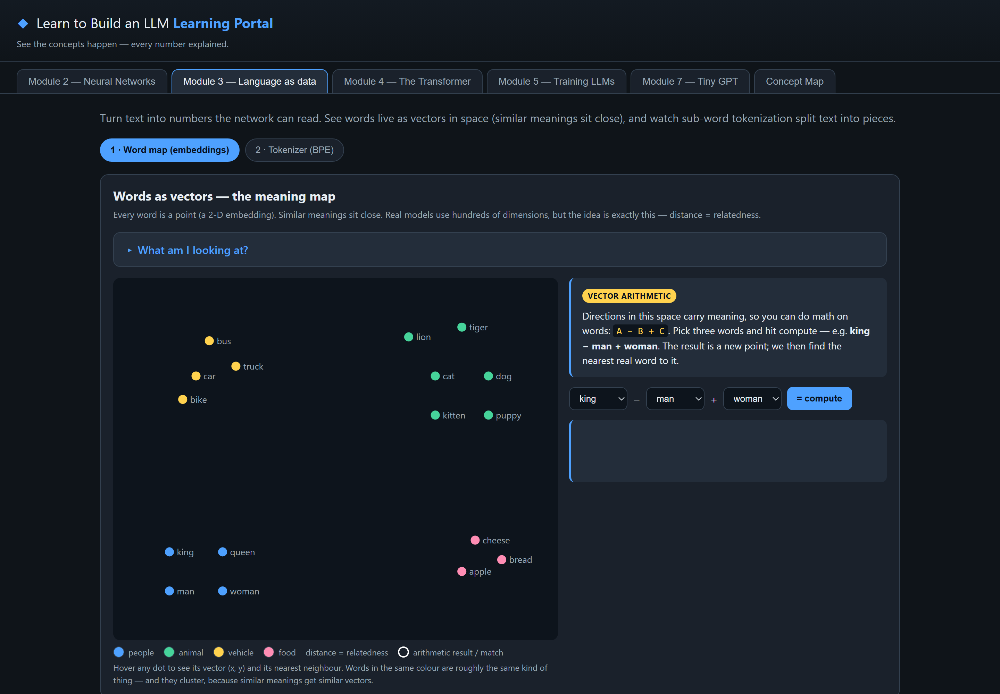
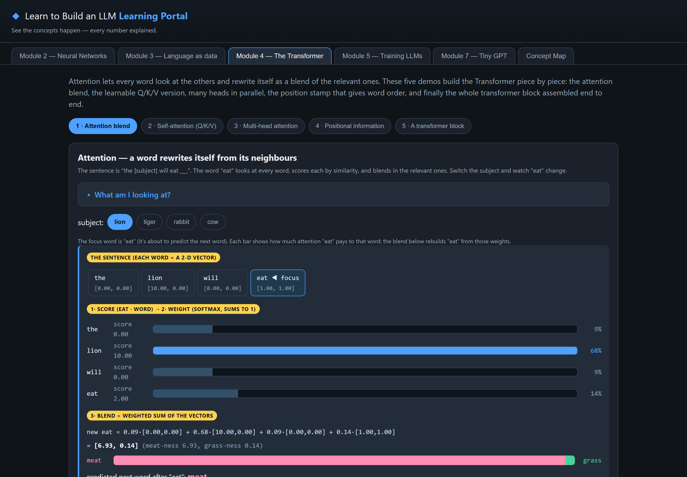
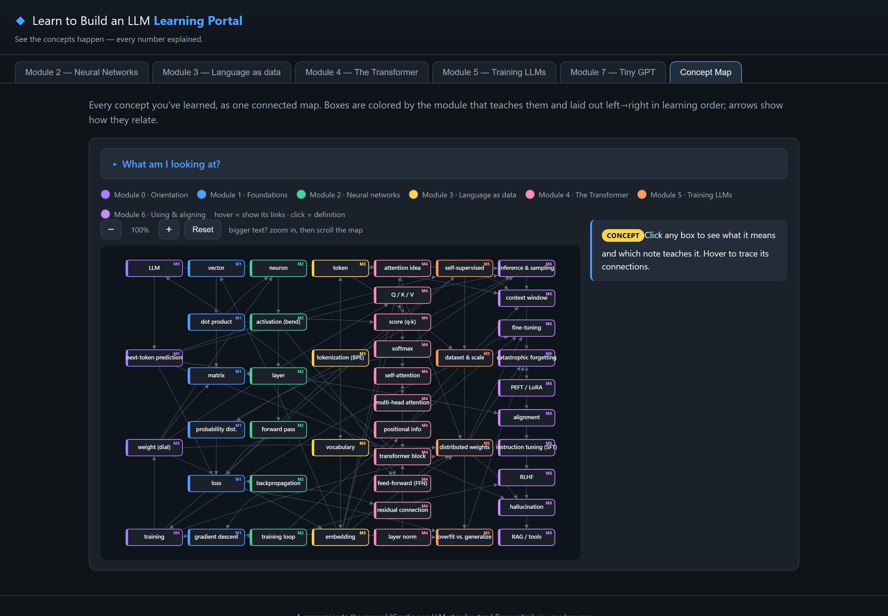

<p align="center">
  
</p>

<h1 align="center">Learn to Build a Fully Working LLM</h1>

<p align="center">
  <b>From &ldquo;what is a vector?&rdquo; to your own tiny GPT.</b><br>
  A from-scratch course taught by an AI tutor that quizzes you Socratically&nbsp;&mdash;<br>
  and remembers exactly where you left off.
</p>

<p align="center">
  <a href="LICENSE"></a>
  <a href="https://github.com/Itaybeeri/learn-to-build-fully-working-llm/stargazers"></a>
  
  
</p>

<p align="center">
  <a href="#quickstart"><b>Quickstart</b></a> &nbsp;·&nbsp;
  <a href="#what-youll-learn"><b>Curriculum</b></a> &nbsp;·&nbsp;
  <a href="#the-portal"><b>The portal</b></a> &nbsp;·&nbsp;
  <a href="CONTRIBUTING.md"><b>Contributing</b></a>
</p>

---

> **Most "build a GPT" tutorials assume you already know the math and the ML. This one assumes nothing.**
> Every term is defined from zero, intuition comes before the math, and you never rely on an idea that
> hasn't been taught yet. By the end you'll have built a working character-level GPT **twice** — once in
> PyTorch, once in **pure NumPy with every gradient written by hand** — trained it, and watched it generate
> text.

<p align="center"><i>Newer to ML and to higher math? That's exactly who this is for.</i></p>

## ✨ Why it's different

|  |  |
|---|---|
| 🎓 **An AI Socratic tutor, not a wall of text** | It teaches a concept, then *asks you a question*. Stuck? It doesn't dump the answer — it guides you with hints and easier questions until *you* get there. |
| 💾 **It remembers where you left off** | Stop any time; run `/continue` and pick up mid-concept. Your progress is saved privately on your own machine. |
| 🔬 **See it happen** | A no-install browser **portal** lets you watch a neuron fire, loss drop, attention blend words together, and your tiny GPT tokenize, train, and generate. |
| 🛠️ **You build the real thing** | The capstone is a working tiny GPT — including a from-scratch NumPy version where you implement every forward and backward pass yourself (gradient-checked to ~1e-7). |

## The portal

A no-install, browser-based companion — **one tab per module** — so you can *see* the concepts instead of
just reading about them. Watch a neuron light up, step through *forward → loss → backward → update* one
number at a time, blend word vectors with attention, and train the tiny GPT.

<p align="center">
  
</p>

<table>
  <tr>
    <td width="33%"></td>
    <td width="33%"></td>
    <td width="33%"></td>
  </tr>
  <tr>
    <td align="center"><sub><b>Embeddings</b> — words as points; do <code>king − man + woman</code></sub></td>
    <td align="center"><sub><b>Attention</b> — a word blends in its neighbours</sub></td>
    <td align="center"><sub><b>Concept map</b> — the whole curriculum, connected</sub></td>
  </tr>
</table>

<p align="center"><sub>Open <code>docs/learn/portal/index.html</code> in any browser — no install, no build step.</sub></p>

## Quickstart

You'll need an AI coding agent to run the tutor — [**Claude Code**](https://claude.com/claude-code) or
[**Codex**](https://openai.com/codex/) both work — and, for the Module 2+ demos, **Python 3.12**.

```bash
git clone https://github.com/Itaybeeri/learn-to-build-fully-working-llm.git
cd learn-to-build-fully-working-llm
```

Then **open the folder in your agent and just say hi** — the tutor greets you, asks a couple of quick
questions, and begins at Module 0 automatically. (You can also run **`/start`** explicitly.)

> **Using Codex?** It reads [`AGENTS.md`](AGENTS.md) automatically, so "say hi" just works. For the
> `/start` · `/continue` · `/recap` commands, copy the prompt files in [`codex/prompts/`](codex/prompts/)
> into `~/.codex/prompts/` (see that folder's README) — optional, since auto-start covers you.

| Command | What it does |
|---|---|
| **`/start`** | First run — onboard and begin at Module 0 |
| **`/continue`** | Resume exactly where you left off |
| **`/recap`** | Get quizzed on what you've learned so far |

> **Prefer to just read?** The whole course is plain Markdown — open
> [`docs/learn/index.md`](docs/learn/index.md) and read front-to-back.
> **Want the visuals?** Open [`docs/learn/portal/index.html`](docs/learn/portal/index.html) in a browser.

## What you'll learn

| Module | You'll understand… |
|---|---|
| **0 · Orientation** | What an LLM actually is, and where its "knowledge" lives |
| **1 · Foundations** | Vectors, matrices & the dot product, functions & gradients, probability — the gentle math, from zero |
| **2 · Neural networks** | Neurons, layers, the forward pass, loss, backprop, the training loop *(+ a network that learns XOR from scratch)* |
| **3 · Language as data** | Tokenization, vocabularies, BPE, and embeddings — turning words into vectors |
| **4 · The Transformer** | Attention, self-attention (Q/K/V), multi-head attention, positional info, and the full transformer block |
| **5 · Training LLMs** | Next-token prediction, datasets & scale, what "learning" adjusts, overfitting vs. generalization |
| **6 · Using & aligning LLMs** | Sampling (temperature, top-k/p), context windows, fine-tuning, instruction tuning & RLHF, limitations |
| **7 · Capstone** | **Build a tiny GPT** — in PyTorch, then again in pure NumPy from scratch; train it, scale it up, generate text |

Full details and links to every note are in **[`docs/learn/index.md`](docs/learn/index.md)**.

## How progress works (and why contributors are safe)

Your learning progress is stored in a private **`.progress/`** folder that is **gitignored** — it never
shows up in `git status` and can never end up in a pull request. So you can learn through the whole course
*and* contribute improvements without your progress ever leaking. See
[`CONTRIBUTING.md`](CONTRIBUTING.md).

## Contributing

Clearer explanations, fixes, and new demos are very welcome — see **[`CONTRIBUTING.md`](CONTRIBUTING.md)**.

## License

Released under the [MIT License](LICENSE) — free to use, learn from, and build on.

---

<h3 align="center">Built by Itay Beeri</h3>

<p align="center">
  <a href="https://github.com/Itaybeeri"></a>
  <a href="https://www.linkedin.com/in/itaybeeri/"></a>
</p>

<p align="center">
  <sub>If this helped you understand how LLMs really work, a ⭐ on the repo means a lot — and I'd love to hear about it on LinkedIn.</sub>
</p>
